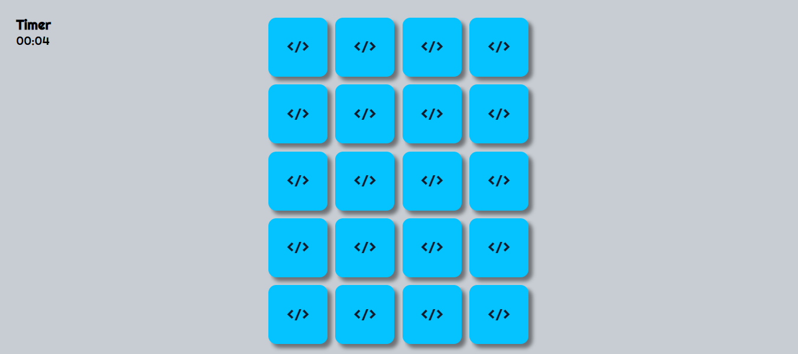

# JOGO DA MEMÓRIA

## <i>Projeto feito com Javascript </i>

## Link: https://bit.ly/3vOxFld

      

 PÁGINAS: </i>

- `Há um campo para a coleta do nome do usuário`
- `Um timer para contagem do jogo`
- `No final da partida, será mostrado o nome do usuário e o tempo que ele levou para concluir`

## <i>Douglas Monteiro</i> 😁🔥🚀

