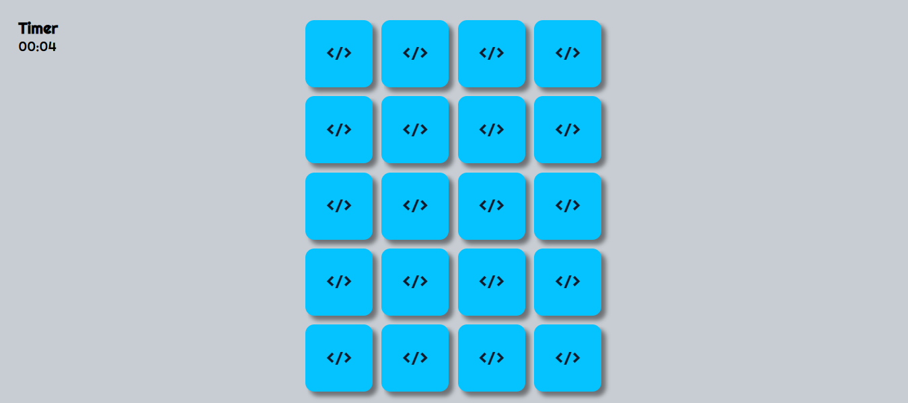

# JOGO DA MEMÓRIA

  

## Descrição:

- `Projeto feito com javascript`
- `Há um campo para a coleta do nome do usuário`
- `Um timer para contagem do jogo`
- `No final da partida, será mostrado o nome do usuário e o tempo que ele levou para concluir`

## <i>Douglas Monteiro</i> 😁🔥🚀
